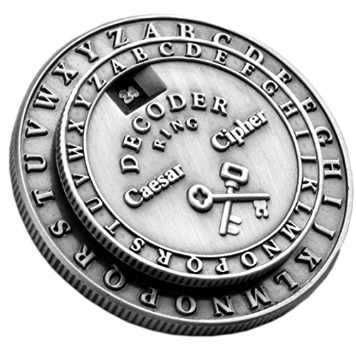

# Caesar Cipher 🤴🏼

## Software Requirements

- Encryption of plain text message.

  -  Create a function called 'encrypt' that takes the 'text'   and 'shift' as inputs.

  - Shift each letter of the 'text' forwards in the alphabet  by the shift amount and print the encrypted text.

  -  Call the encrypt function and pass in the user inputs.
 

- Decryption of plain text message.

  -  Create a function called 'decrypt' that takes the 'text'   and 'shift' as inputs.

  - Shift each letter of the 'text' *backwards* in the alphabet by the shift amount and print the decrypted text.
 

-  Check if the user wanted to encrypt or decrypt the message by checking the 'direction' variable. Then call the correct function based on that 'direction' variable. You should be able to test the code to encrypt *AND* decrypt a message.
 

- Combine the encrypt() and decrypt() functions into a single function called caesar().
 
  - Call the caesar() function, passing over the 'text', 'shift' and 'direction' values.
 

##### User Experience Improvements

- Import and print the logo from art.py when the program starts.
 

- Figure a solution in case the user enters a number/symbol/space and integrate in the encryption algorithm.
 

- Figure a way to ask the user if they want to restart the cipher program.
 

- What if the user enters a shift that is greater than the number of letters in the alphabet?
